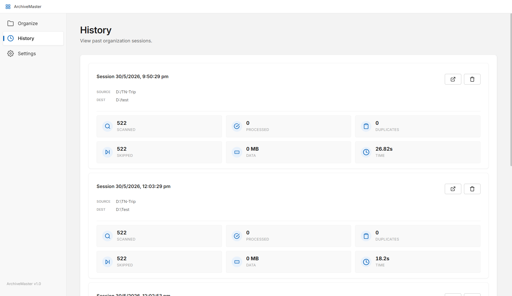
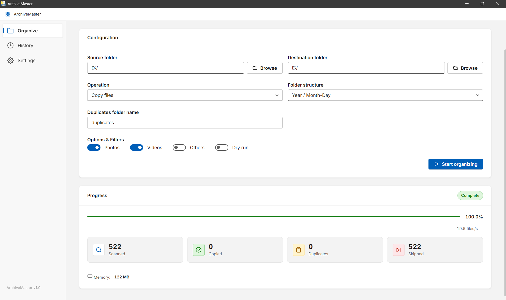
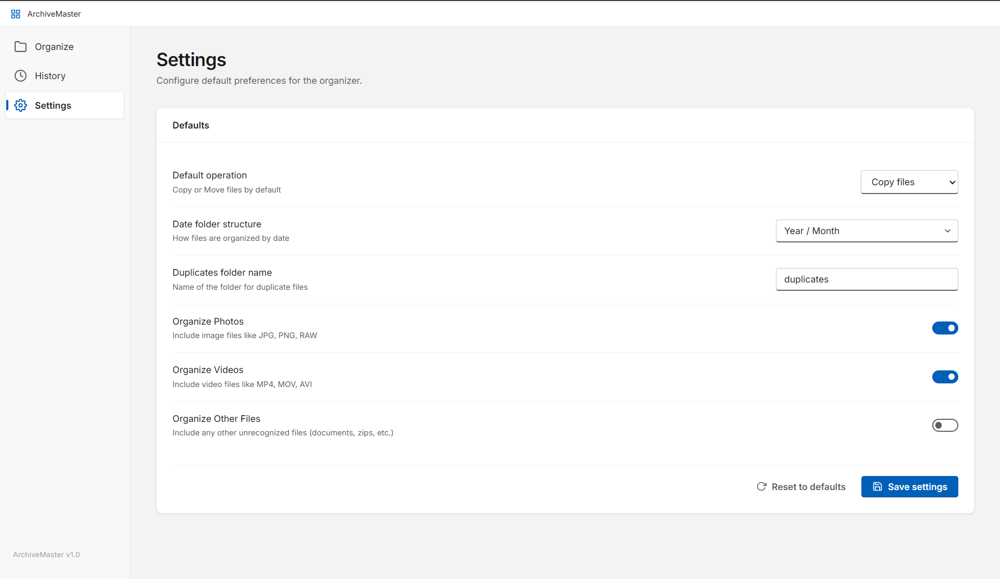

<div align="center">
  
  <h1>🗄️ ArchiveMaster</h1>
  <p><strong>The smart, lightning-fast native desktop application to organize your digital life.</strong></p>
  
  [](https://github.com/imShuheb/ArchiveMaster/actions)
  [](https://github.com/imShuheb/ArchiveMaster/releases)
  [](#)
</div>

---

## 📸 Screenshots

| Organize | History | Settings |
| :---: | :---: | :---: |
|  |  |  |

---

## 🌟 What is ArchiveMaster?

Have you ever dumped thousands of scattered photos, videos, and documents into a hard drive, only to realize it's a complete mess? **ArchiveMaster** is a native desktop application designed to solve that problem.

It recursively scans any folder you point it to, identifies duplicates with cryptographic precision, and neatly copies or moves your media into beautifully organized, chronological folders (e.g., `2024/Jan/Photos`).

### ✨ Key Features
- **Smart Deduplication**: Identifies exact file matches using SHA-256 hashing. If it finds duplicates, it safely segregates them into a dedicated `duplicates/` folder.
- **Granular Control**: Toggle exactly what you want to organize (`Photos`, `Videos`, or `Others`).
- **EXIF Date Extraction**: Doesn't just rely on file creation dates; it intelligently reads the metadata embedded inside your photos to figure out exactly when they were taken.
- **Beautiful Native UI**: A modern desktop interface built with Fluent Design principles, featuring real-time progress bars, speed metrics, and ETA calculations.
- **Session History**: Keeps a persistent log of your past organization runs, detailing exactly how much data was processed and saved.

---

## 📥 Download & Install

Download the latest version compiled securely via GitHub Actions.

### 🪟 Windows

**1. Windows Installer (Recommended)**
Download `ArchiveMaster_Setup.exe` and run it to install the application to your Start Menu.
👉 **[Download Installer (.exe)](https://github.com/imShuheb/ArchiveMaster/releases/latest/download/ArchiveMaster_Setup.exe)**

**2. Windows Portable**
Alternatively, download the standalone `.zip` if you don't want to install anything. Just extract and run.
👉 **[Download Portable (.zip)](https://github.com/imShuheb/ArchiveMaster/releases/latest/download/ArchiveMaster-Windows-Portable.zip)**

### 🐧 Linux

Download the standalone compressed tar archive containing the Linux binary. Extract it and run `./ArchiveMaster`.
👉 **[Download Portable (.tar.gz)](https://github.com/imShuheb/ArchiveMaster/releases/latest/download/ArchiveMaster-Linux-Portable.tar.gz)**

*(You can also browse all historical files on the [Releases Page](https://github.com/imShuheb/ArchiveMaster/releases)).*

---

## 🛠️ For Developers: Building Locally

Want to run the application directly from source or compile it yourself?

### 1. Install Dependencies
```bash
# Windows
pip install -r requirements.txt
pip install pyinstaller

# Linux (Ubuntu/Debian)
sudo apt-get update
sudo apt-get install -y libgirepository1.0-dev gcc libcairo2-dev pkg-config python3-dev gir1.2-gtk-3.0
pip install -r requirements.txt
pip install pyinstaller
```

### 2. Run from Source
```bash
python app.py
```

### 3. Compile the Executable
Use PyInstaller to bundle the code into a standalone portable folder:

**Windows:**
```bash
python -m PyInstaller --noconfirm --onedir --windowed --icon=app.ico --hidden-import clr --hidden-import win32timezone --hidden-import PIL --hidden-import PIL.ExifTags --add-data "gui;gui/" --name "ArchiveMaster" app.py
```
*(Your compiled app will be located in `dist/ArchiveMaster/ArchiveMaster.exe`)*

**Linux:**
```bash
python -m PyInstaller --noconfirm --onedir --windowed --icon=app.ico --hidden-import clr --hidden-import win32timezone --hidden-import PIL --hidden-import PIL.ExifTags --add-data "gui:gui/" --name "ArchiveMaster" app.py
```
*(Your compiled app will be located in `dist/ArchiveMaster/ArchiveMaster`)*

---

<div align="center">
  <i>Built with ❤️ using Python and pywebview. Open source under the MIT License.</i>
</div>
